

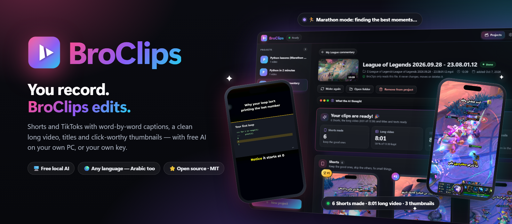

# BroClips

**You record. BroClips edits.**

Turn your own recordings into **Shorts / TikToks with word-by-word captions**, a **clean long video**, **titles**
and **click-worthy thumbnails** — with free AI on your own PC, or your own API key.

   

---

## What it does

You recorded something where you **talk** — a gaming session with commentary, a lesson for your students, a
programming tutorial, a podcast. Describe your videos in one sentence, add the recording, press **Make**:

| You get | |
|---|---|
| ✂️ **Shorts / TikToks / Reels** | The best self-contained moments, vertical 1080×1920, **big captions where the spoken word lights up**, a title on top. The picture follows the action — or shows the whole screen for tutorials, so code stays readable. |
| 🎞️ **A clean long video** | Your whole recording with the long silences cut out (jump cuts), with YouTube chapters. |
| 📝 **Titles, descriptions, hashtags** | For YouTube, Shorts, TikTok and Reels, in your language — one click to copy. |
| 🖼️ **Thumbnails + a Thumbnail studio** | Automatic thumbnails in different styles, then change anything with clicks: picture, words, fonts, colours, 3D emoji, arrows, circles, a cut-out of a person or thing. Press 🎲 for more, or ask the AI: *"make 4 funny ones with a red arrow"*. |
| 🏃 **Marathon mode** | Instead of one AI answer, the AI works in many small rounds: it lists every possible moment, then compares them two at a time in a tournament (each pair asked in both orders). Slower, but it finds better moments. |

**Any language** — tested in English and Egyptian Arabic (right-to-left captions and thumbnails included).

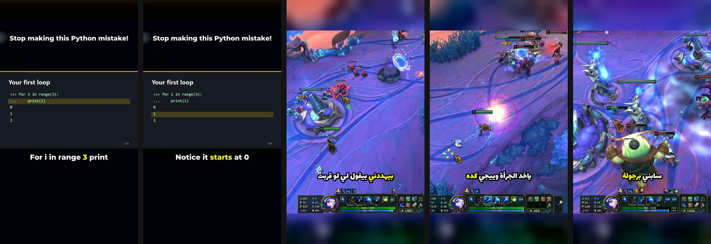

Real output: two Shorts from a Python lesson (whole screen kept, spoken word in yellow) and three from Egyptian-Arabic League of Legends commentary (the picture follows the fight).

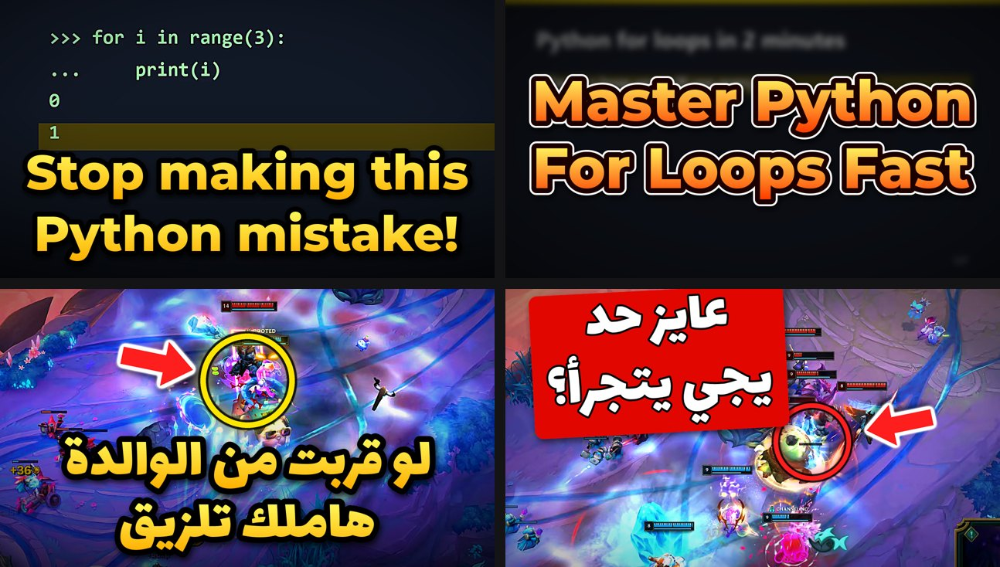

Automatic thumbnails — "headline", "zoom + circle", "label" styles. Every one can be changed in the studio.

## Who it is for

- 🎮 **Gamers** who talk while they play — your funniest moments become Shorts by themselves.
- 👩‍🏫 **Teachers** recording lessons — one lesson becomes several short explainers and a clean video.
- 💻 **Programmers** making tutorials — screen recordings are never cropped, your code stays readable.
- 🎙️ **Podcasters and talking-head creators.**

## How it works

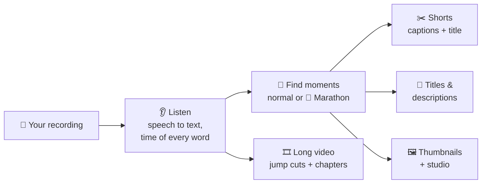

BroClips only **reads** your recordings — it never changes, moves or deletes them. Everything it makes goes into its
own folder, one folder per project and video.

While it works you see every step and, live, what the AI is thinking — here 🏃 Marathon mode is comparing moments:

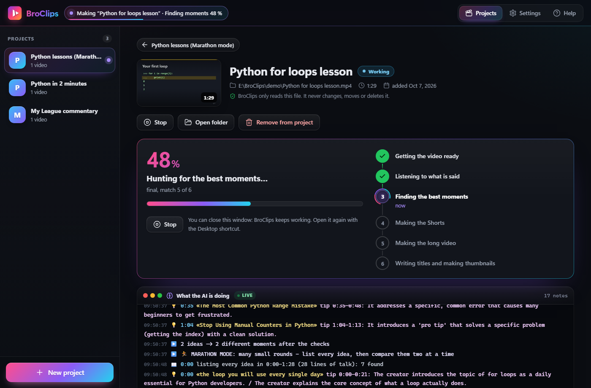

When it is done: the numbers at a glance, every Short in a phone frame to play, keep or skip, the long video with
clickable chapters, the thumbnails and the texts to copy.

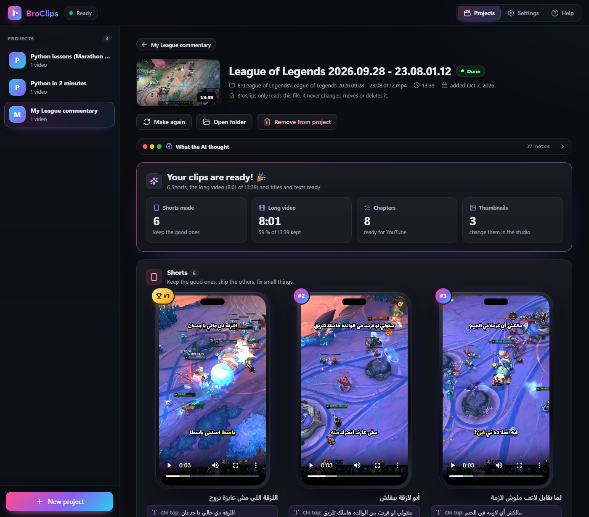

## Your AI, your choice

| Option | Cost | Privacy | You need |
|---|---|---|---|
| 🖥️ **Local** — Ollama + Whisper | Free | Nothing leaves your PC | A decent PC; an NVIDIA GPU makes it much faster |
| 🔑 **Google Gemini** key | Free tier available | Your audio / text go to Google | A key from [aistudio.google.com](https://aistudio.google.com/apikey) |
| 🔑 **OpenAI** or any OpenAI-compatible service (OpenRouter, Groq, LM Studio…) | Pay per use (LM Studio is local) | Your audio / text go to that service | A key |
| 🔑 **Anthropic Claude** key | Pay per use | Your text goes to Anthropic | A key from [console.anthropic.com](https://console.anthropic.com) |

You choose separately who **listens** (speech-to-text) and who **thinks** (finds moments, writes titles, designs
thumbnails). Video pictures are sent to a cloud AI only if you switch that on. Keys are stored only on your PC
(`secrets.json` in your BroClips folder) and are never shown again in full.

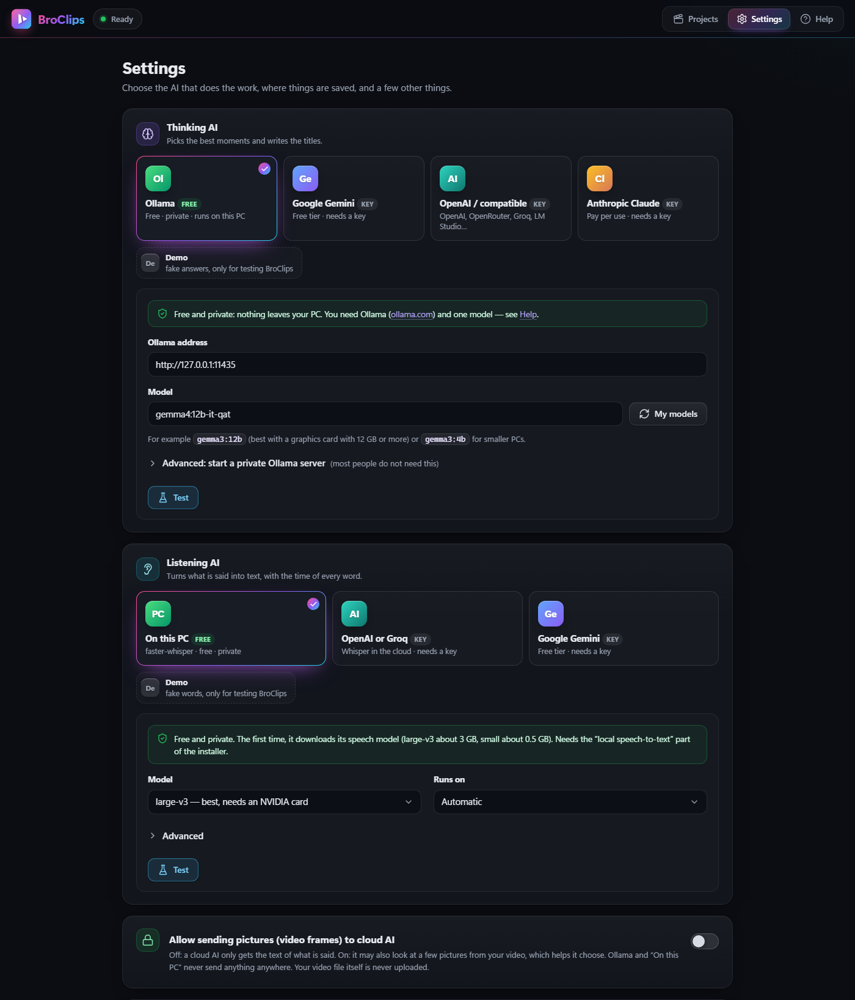

## Install (Windows 10 / 11)

1. Install **Python 3.10 or newer** from [python.org](https://www.python.org/downloads/) — tick *"Add Python to PATH"*.
2. Download BroClips: green **Code** button → **Download ZIP**, unzip it (or `git clone https://github.com/omar1001/BroClips`).
3. Double-click **`install.bat`**. It:
   - checks for **ffmpeg** and offers to install it (`winget install Gyan.FFmpeg`),
   - creates its own Python environment (`.venv`) and installs what BroClips needs,
   - asks whether to install **local speech-to-text** (faster-whisper + NVIDIA libraries, about 1.5 GB),
   - downloads the fonts and the 3D emoji (a few MB), and asks about the **cut-out model** for thumbnails (928 MB, or a
     light 224 MB version),
   - puts a **BroClips** icon on your Desktop.
4. **Free local AI:** install [Ollama](https://ollama.com), then in a terminal run `ollama pull gemma3:12b` (or
   `gemma3:4b` for smaller PCs). **Or** open **Settings** and paste an API key.

Run it with the Desktop icon, or `run.bat` (shows a log window), or `python -m broclips`. The first start opens
Settings with a short welcome; **Help** inside the app explains every page.

Advanced install options

- `scripts\install.ps1 -Python "C:\path\to\python.exe"` reuses a Python that already has the packages (no new
  environment).
- `python -m broclips.assets --essential` downloads fonts / emoji again; `--cutout general|lite` the cut-out model;
  `--from <folder>` copies them from another folder instead of downloading.
- `python -m broclips --no-window --port 8770` runs only the local server (open http://127.0.0.1:8770).
- Tests: `pip install -r requirements-dev.txt`, then `python -m pytest -q`. `python tests/make_sample.py` makes a
  90-second sample lesson video (Windows text-to-speech) to try BroClips without your own recording.

## How to use it

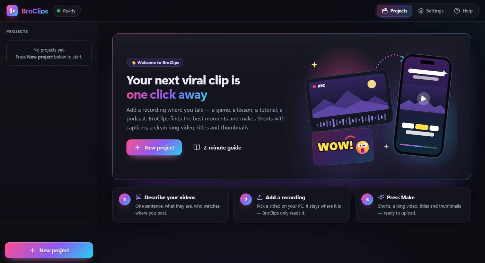

1. **New project** → describe your videos in a sentence or two (or click an example) —
   *"Short Python lessons for beginners, English, for Shorts and TikTok, friendly tone."* Pick the video type
   (gameplay, talking to camera, screen recording, podcast) and where you post.
2. **Add videos** → pick your recordings.
3. **Make** → watch the progress and *What the AI is doing*. A 90-second lesson takes about a minute and a half on a
   gaming PC with local AI; a 14-minute gaming session about 7 minutes.
4. **Keep** or **Skip** each Short, fix a caption or the start/end (the pencil), open the **Thumbnail studio**, copy
   your titles. Everything is in the project's folder (**Open folder**), ready to upload.

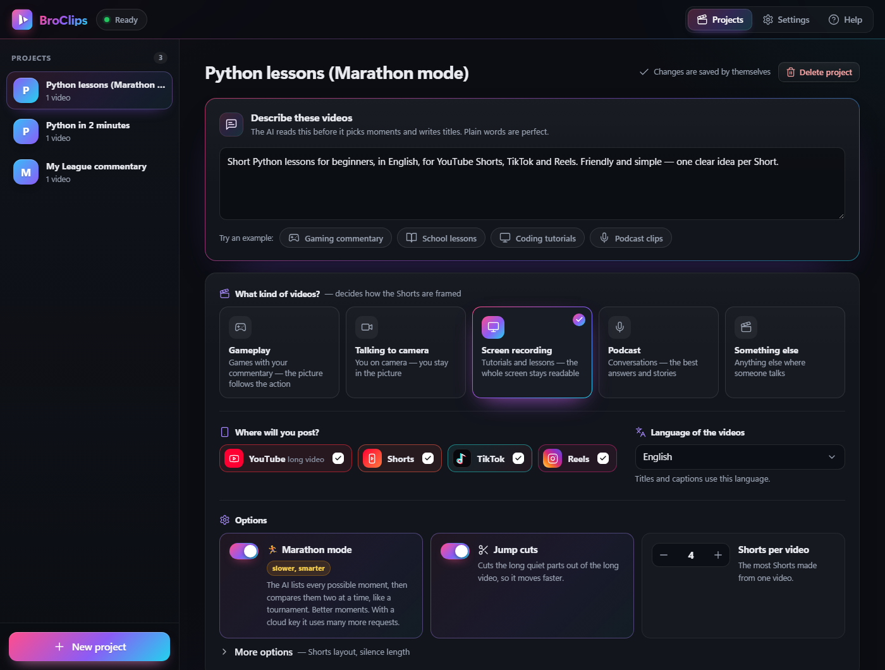

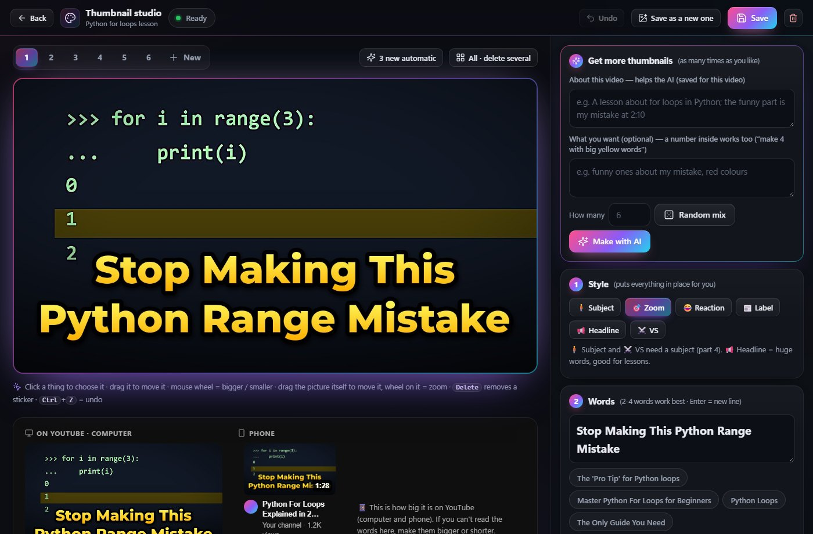

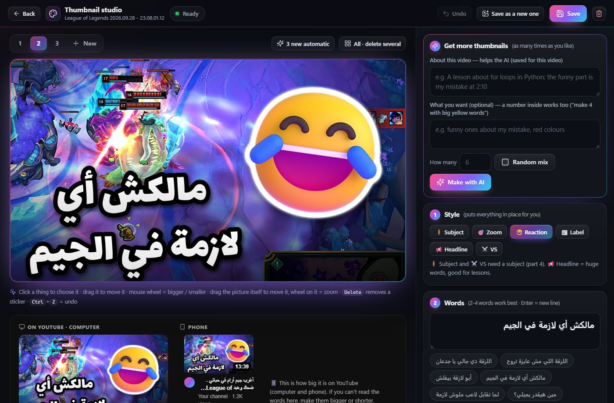

## FAQ

**Does anything leave my computer?** Not in local mode. With a cloud key, the audio (listening) and the text
(thinking) go to that provider — pictures only if you allow it. Your video file itself is never uploaded.

**I have no NVIDIA GPU.** It still works: a smaller speech model and CPU video encoding — just slower. Or use a key.

**Which local model?** `gemma3:12b` is a good start with a 12–16 GB graphics card, `gemma3:4b` for smaller ones.

**Can it upload to YouTube for me?** No — you stay in control and upload yourself.

**It paused while I was gaming.** That's on purpose if you listed your game in Settings → *Pause while these
programs run*: heavy work waits until you finish (**Run now** overrides it).

## Known limitations

BroClips is new, built by one person (with AI help) and tested mainly on one gaming PC. Honest list:

- **Windows first.** The code is plain Python + ffmpeg and should run elsewhere with `python -m broclips`, but the
  installer, file pickers and desktop icon are Windows-only and macOS/Linux are untested.
- The **cloud AI options** passed tests against recorded API answers, not long real-world use yet — if a **Test** in
  Settings fails, the log in your BroClips folder says why.
- Fonts cover **Latin and Arabic** scripts only for now.
- Automatic thumbnails pick their picture by colour, sharpness and motion; they can land on a menu screen — the studio
  fixes that in two clicks.
- Small local models sometimes write odd titles; you can edit everything before you post.

## Built with AI — honestly

BroClips was designed by **Omar** ([@omar1001](https://github.com/omar1001)) and written with heavy help from
**Claude Code**, Anthropic's AI coding assistant. Omar decided what it should do and how, made the trade-offs and
tested it on his own videos — his Egyptian-Arabic League of Legends commentary first; the AI wrote most of the code
under his direction (the design spec and the change log are in [`docs/`](docs)). It grew out of Omar's private tool for his own gaming
channel.

## Credits

[ffmpeg](https://ffmpeg.org) · [faster-whisper](https://github.com/SYSTRAN/faster-whisper) (MIT) ·
[Ollama](https://ollama.com) · [BiRefNet](https://github.com/ZhengPeng7/BiRefNet) cut-outs (MIT) ·
[Microsoft Fluent Emoji](https://github.com/microsoft/fluentui-emoji) (MIT) · fonts from
[Google Fonts](https://fonts.google.com) and [Montserrat](https://github.com/JulietaUla/Montserrat) (SIL Open Font
License) · [FriBidi](https://github.com/fribidi/fribidi) (LGPL-2.1, Arabic text on Windows) ·
[Pillow](https://python-pillow.org) · [onnxruntime](https://onnxruntime.ai) · [Lucide](https://lucide.dev) icons (ISC).

Downloaded fonts, emoji and models keep their own licences; they are not part of this repository.

## License

[MIT](LICENSE) © 2026 Omar Muhammad Abossrie
